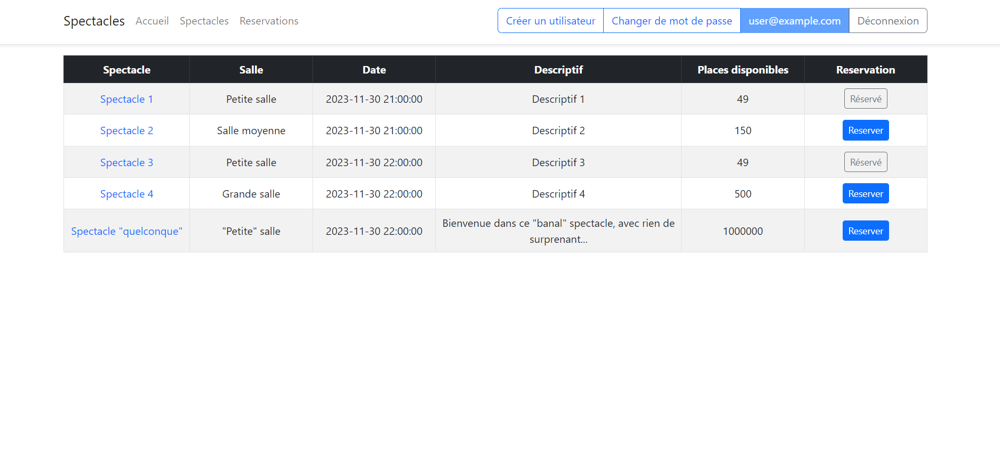
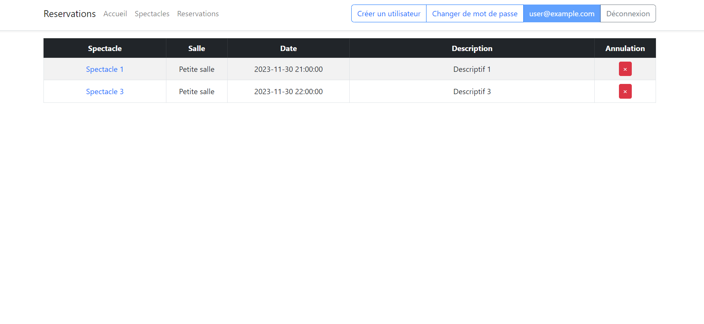
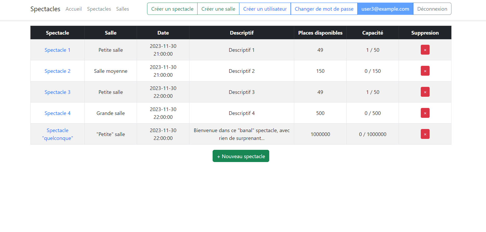
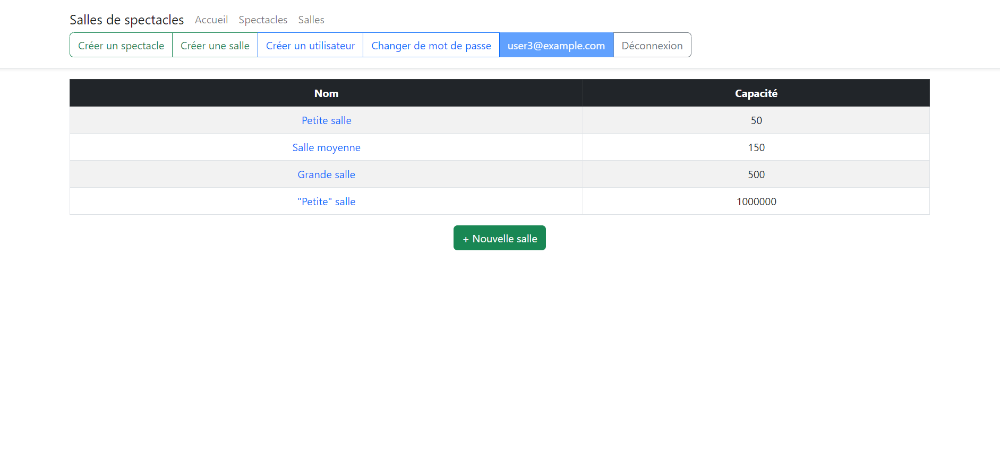
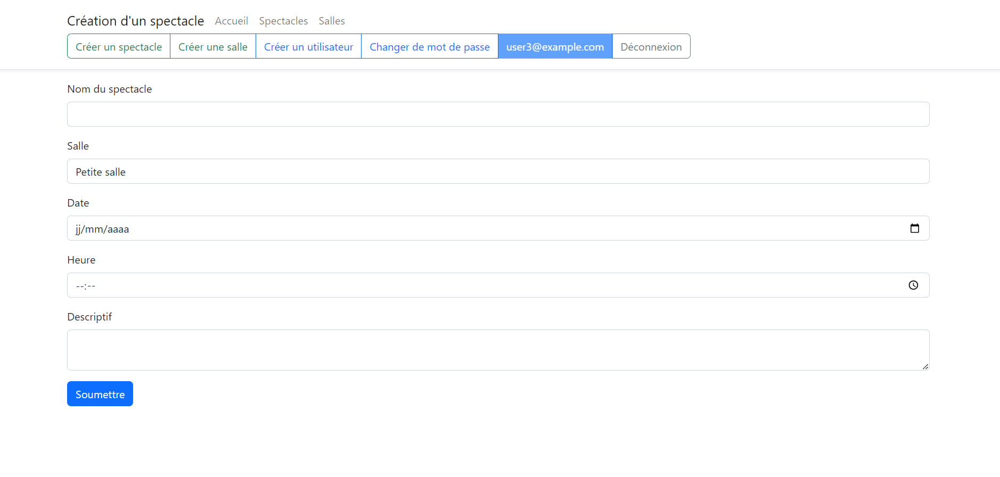
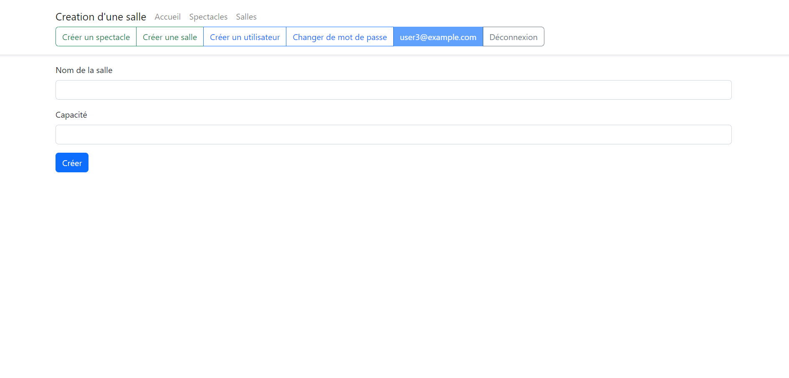

# Booking-Show

## Description
Website project which consists of booking for shows, there are several features, such as authentication, view shows and theaters details. There also are different bonus features according 
to whether it's a client or a manager connected (if it's a manager he can create or delete shows and theaters)

To make it work:
On the terminal of vscode (or of an equivalent editor)
- pip install -r requirements.txt
- flask run

Then in a web broswer enter the local host address in the url
- 127.0.0.1:5000

## Author
Realized by Henrique D.M.M

## Demo images
### All shows (from the client perspective)

### All the show the client booked

### All shows (from the manager perspective)

### All theaters (only accessible by the manager)

### Show creation

### Theater creation

